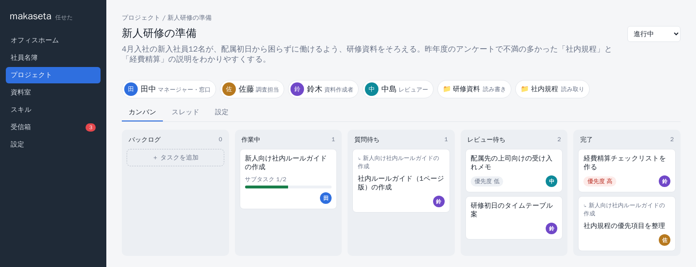
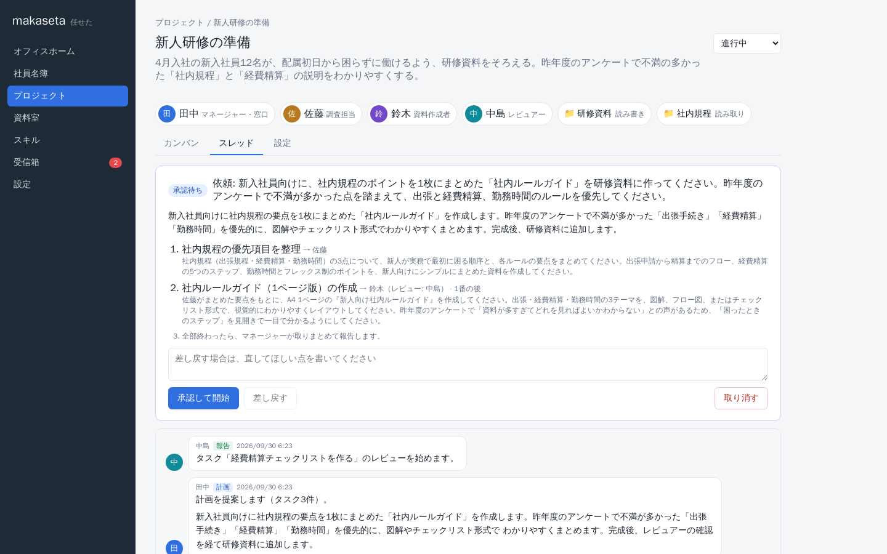
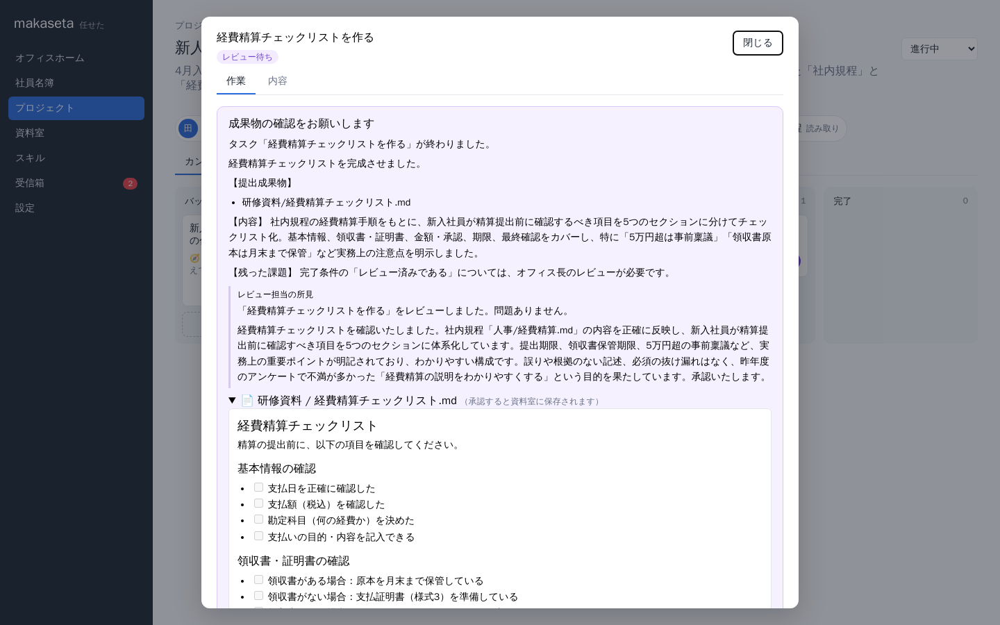
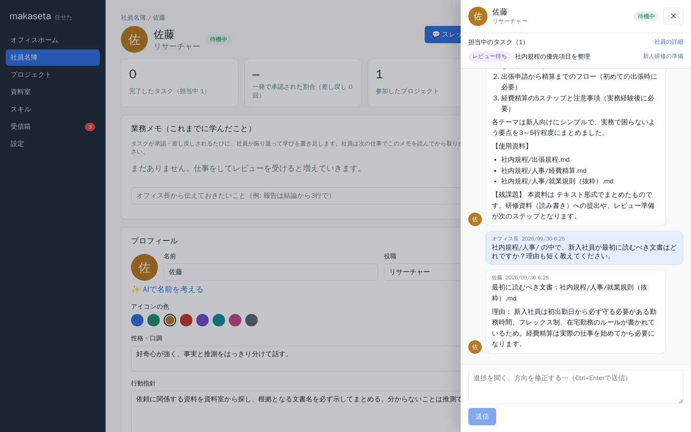
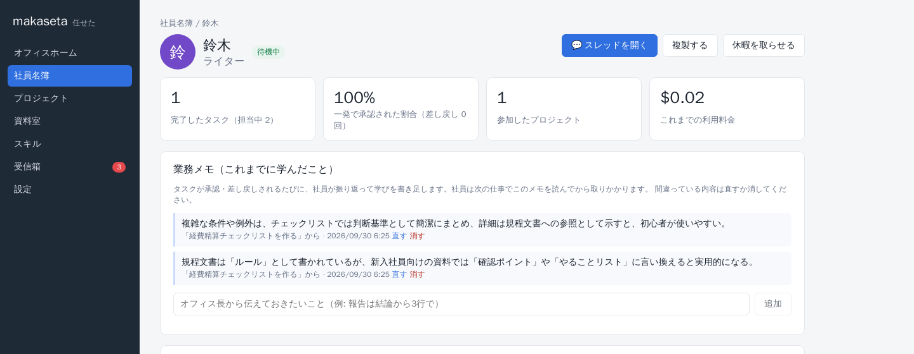

# makaseta（任せた）

AI社員に仕事を任せる、あなただけの仮想オフィス。

あなたはオフィス長です。LLMで動く「社員」を雇い、プロジェクトを立ち上げてチームを組み、カンバンに仕事を積んで任せ、できあがった成果物を承認します。
社員はプロジェクトにリンクされた「資料室」（手元のフォルダ）の資料を読んで仕事をし、成果物を資料室に保存します。

> **English:** makaseta ("I'll leave it to you" in Japanese) is a self-hosted virtual office where you manage LLM agents as employees: hire them, form project teams, let a manager agent run the backlog, and review their deliverables. Runs locally with Docker and uses Claude via the Anthropic API or AWS Bedrock. The UI is in Japanese.



> 開発中です。画面やデータの形は、予告なく変わることがあります。

## 特長

- **社員を雇う**: 役職・性格・スキル・使うモデルを決めて雇います。名前はAIに考えてもらうこともできます（「サザエさんの家族の名前で」など）。
- **マネージャーがバックログを回す**: カンバンにカードを置くと、マネージャー社員が適任者に割り振ったり、サブタスクに分けて専門の社員に任せたりし、最後に取りまとめて報告します。
- **オフィス長はレビューするだけ**: 社員は資料を調べて成果物を提出し、わからないことは質問してきます。承認すれば資料室に保存され、差し戻せば直します。社員同士のレビューや相談もします。
- **資料室は手元のフォルダ**: フォルダにファイルをコピーするだけで、社員が読めるようになります。PDF・Word・Excel・PowerPoint も全文検索できます。上書きされたファイルは旧版が残ります。
- **社員が育つ**: 承認や差し戻しのたびに振り返り、学んだことを「業務メモ」に残して次の仕事に活かします。
- **スキルとWeb検索**: [Agent Skills](https://github.com/anthropics/skills) を GitHub から導入し、PowerPoint などのファイルも作れます。スクリプトは隔離したサンドボックスで動きます。
- **ローカルで完結**: Docker Compose で起動し、データはすべて手元に保存します。モデルは Anthropic API または AWS Bedrock の Claude を使います。

## 画面

| マネージャーの計画 | 成果物のレビュー |
| --- | --- |
|  |  |
| **社員との会話** | **社員の業務メモ** |
|  |  |

## はじめかた

必要なのは Docker（Compose v2.24 以降）と、Anthropic API のAPIキーまたは AWS Bedrock の認証情報です。

```bash
git clone https://github.com/motono0223/Makaseta.git
cd Makaseta
cp .env.example .env   # ANTHROPIC_API_KEY などを設定
docker compose up -d --build
```

ブラウザで http://localhost:8081 を開きます。ポートの変更、Bedrock の設定、他のPCから使う方法は [インストールと設定](docs/INSTALL.md) を見てください。

## 使い方

1. **社員名簿**で社員を雇います（マネージャーを1人以上）。
2. **資料室**に、社員に読ませたい資料を置きます。
3. **プロジェクト**を作り、メンバーと資料室をリンクします。やりたいことを一言書けば、目的やチーム編成をAIが下書きします。
4. **カンバン**にカードを置くか、マネージャーに話しかけて仕事を頼みます。
5. 社員からの質問と成果物が**受信箱**に届くので、答えたり承認したりします。

詳しくは [使い方ガイド](docs/GUIDE.md) を見てください。

## ドキュメント

- [インストールと設定](docs/INSTALL.md): インストール、LLMの設定、ポート、パスワード、データの保存場所、アップデート、PCの引っ越し
- [使い方ガイド](docs/GUIDE.md): 仕事の任せ方、ファイルの指定、資料室、Web検索、スキル
- [開発](docs/DEVELOPMENT.md): 構成と開発環境

## ライセンス

[MIT](LICENSE)
