# 使い方ガイド

新人研修の準備を例に、makaseta で社員を雇い、仕事を任せ、成果物を受け取るまでの流れを説明します。インストールがまだの場合は [インストールと設定](INSTALL.md) から始めてください。

- [1. オフィスホーム](#1-オフィスホーム)
- [2. 社員を雇う](#2-社員を雇う)
- [3. 資料室に資料を置く](#3-資料室に資料を置く)
- [4. プロジェクトを立ち上げる](#4-プロジェクトを立ち上げる)
- [5. 仕事を頼む](#5-仕事を頼む)
- [6. サブタスクの進み方](#6-サブタスクの進み方)
- [7. 質問に答える](#7-質問に答える)
- [8. 成果物をレビューする](#8-成果物をレビューする)
- [9. 社員と話す](#9-社員と話す)
- [10. 社員が育つ](#10-社員が育つ)
- [資料室の詳しい使い方](#資料室の詳しい使い方)
- [Web検索](#web検索)
- [スキル（Agent Skills）](#スキルagent-skills)
- [よくある質問](#よくある質問)

## 1. オフィスホーム

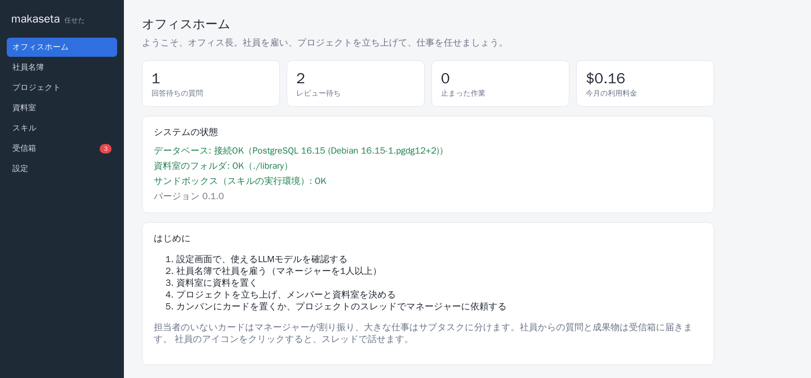

最初の画面です。オフィス長（あなた）が対応するもの（回答待ちの質問、レビュー待ちの成果物、止まった作業）の件数と、今月の利用料金が出ます。数字を押すと受信箱が開きます。

左のメニューの「受信箱」のバッジは、あなたの対応を待っている件数です。

## 2. 社員を雇う

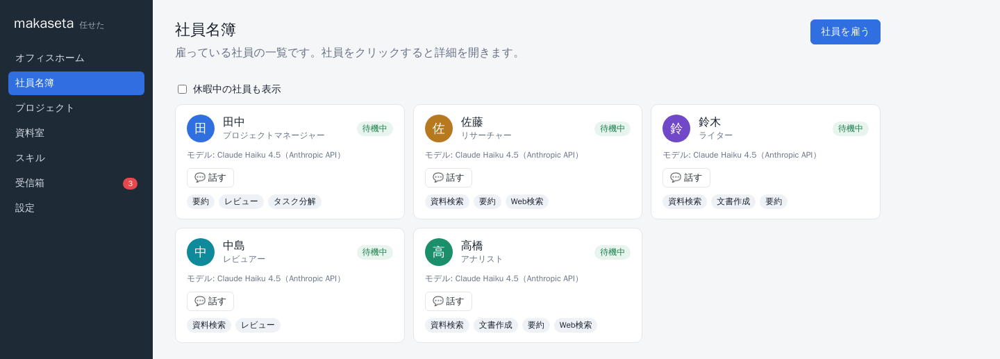

「社員名簿」の「社員を雇う」から、LLMで動く社員を雇います。

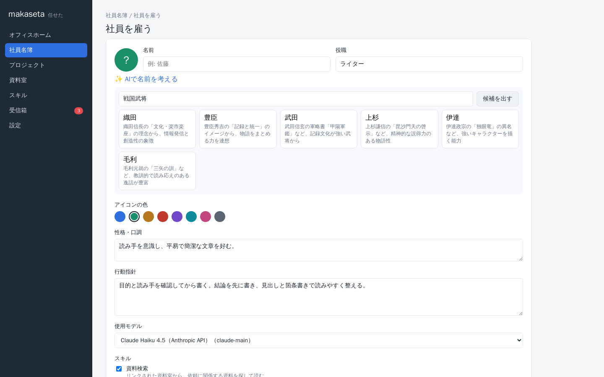

- **役職**を選ぶと、性格・行動指針・スキルの初期値が入ります（プロジェクトマネージャー、リサーチャー、ライター、アナリスト、レビュアー）。
- **使用モデル**は社員ごとに選べます。料金の安いモデルと賢いモデルを使い分けられます。
- **✨ AIで名前を考える**で「戦国武将」「サザエさんの家族」のようにテーマを書くと、名前の候補を出してくれます。
- まずは、マネージャー1人と、調べる人・書く人・確認する人を雇うのがおすすめです。

休ませたい社員は、詳細画面の「休暇を取らせる」で一覧から外せます（業務メモや実績は残り、いつでも復帰できます）。「複製する」で、業務メモごと同じ社員を増やすこともできます。

## 3. 資料室に資料を置く

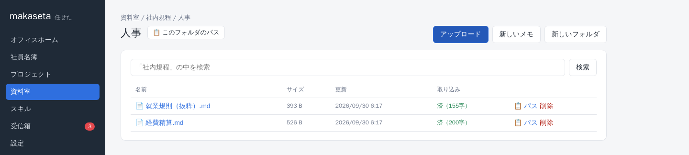

「資料室」は、社員が読む資料と、社員が作った成果物の置き場です。中身はホストのフォルダ（既定は `./library`）そのものなので、エクスプローラーや `cp` でファイルをコピーするだけで追加できます。画面からのアップロードもできます。

資料室は、プロジェクトごとに「読み取りのみ」か「読み書き」でリンクします。社員が読めるのは、参加しているプロジェクトにリンクされた資料室だけです。詳しくは [資料室の詳しい使い方](#資料室の詳しい使い方) を見てください。

## 4. プロジェクトを立ち上げる

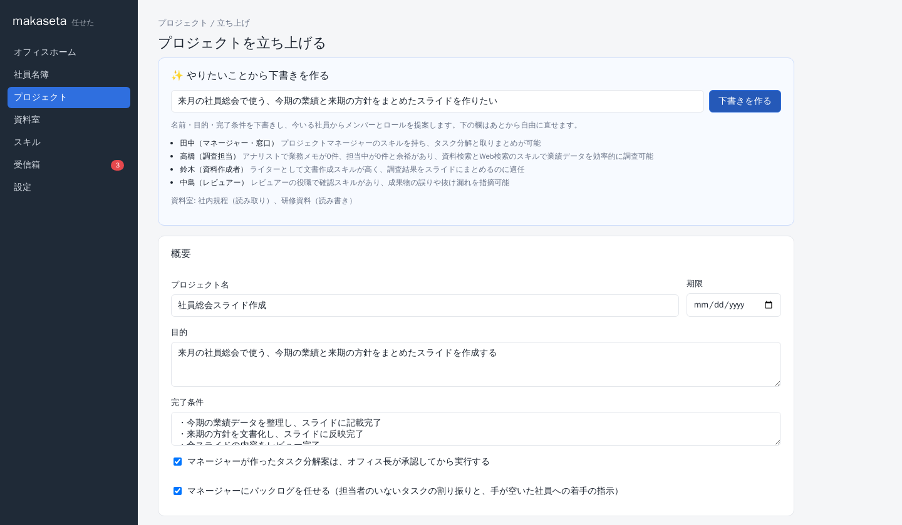

「プロジェクト」の「プロジェクトを立ち上げる」で、名前・目的・完了条件、メンバーとロール、リンクする資料室を決めます。

- 「✨ やりたいことから下書きを作る」に一言書いて「下書きを作る」を押すと、名前・目的・完了条件とチーム編成をAIが提案します。足りない役割は、既存の社員の複製やテンプレートからワンクリックで雇えます。
- メンバーには**マネージャーを1人以上**入れます。「窓口」のマネージャーがオフィス長からの依頼を受けます。
- 成果物を保存させたい資料室は「読み書き」にします。
- **マネージャーにバックログを任せる**（既定でオン）: 担当者のいないカードの割り振りと、手が空いた社員への着手の指示をマネージャーに任せます。
- **タスク分解案は、オフィス長が承認してから実行する**（既定でオン）: オフにすると、マネージャーの計画をそのまま実行します。

## 5. 仕事を頼む

頼み方は3つあります。

### カンバンにカードを置く

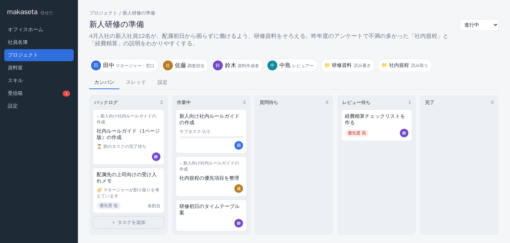

カンバンの「＋ タスクを追加」でカードを作ります。

- **担当者を決めたカード**は、その社員がすぐ（手が空きしだい）作業を始めます。
- **担当者のいないカード**は、マネージャーが中身を読んで振り分けます（カードに「🧭 マネージャーが割り振りを考えています」と出ます）。小さな仕事なら向いている社員に割り振り、大きな仕事ならサブタスクに分ける計画を立てます。
- 「レビュー担当」を決めると、担当者の報告のあと、まずレビュー担当の社員が成果物を確認し、必要なら担当者に直させてから、あなたに回します（往復は2回まで）。

### マネージャーに依頼する


プロジェクトの「スレッド」タブで依頼を書いて「依頼する」を押すと、窓口のマネージャーがメンバーに割り振った計画を提案します。マネージャーのアイコンから会話で「〜をお願い」と頼んでも、依頼としてカンバンに登録されます。

- 計画は受信箱にも届きます。内容を見て「承認して開始」を押すと、サブタスクが作られて作業が始まります。
- 直してほしい点があれば、コメントを書いて「差し戻す」と、マネージャーが計画を作り直します。

### カードを分解してもらう

大きなカードを開いて「🧭 マネージャーに分解させる」を押すと、そのカードをサブタスクに分ける計画をマネージャーが立てます。

## 6. サブタスクの進み方


- 依頼のカード（親タスク）には「サブタスク 1/2」のように進み具合が出ます。サブタスクのカードには、上に親タスクの名前が出ます。
- サブタスクは前後関係の順に自動で始まります。前のタスクを待っているカードには「⏳ 前のタスクの完了待ち」と出ます。
- サブタスクが全部終わると、マネージャーが親タスクで結果を取りまとめて報告します。

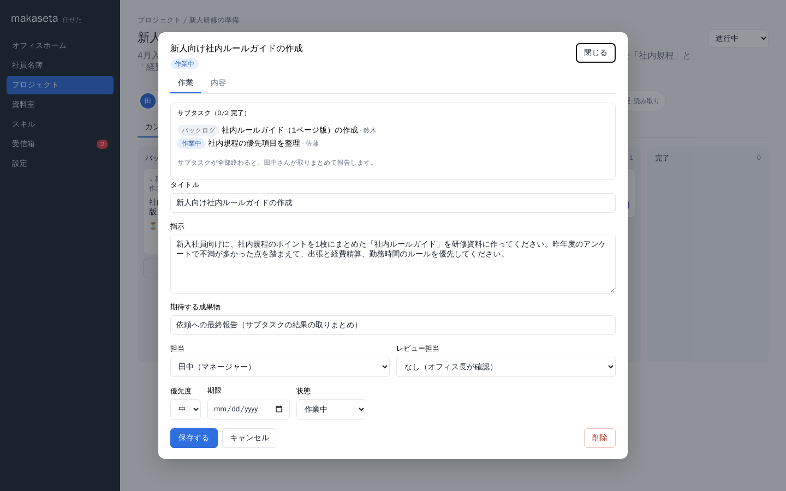

親タスクを開くと、サブタスクの一覧と状態を確認できます。

手が空いた社員には、マネージャーがバックログの次の仕事を着手させます。1人が同時に進める仕事の数は `.env` の `MAX_ACTIVE_TASKS_PER_AGENT`（既定 1）で決まります。

## 7. 質問に答える

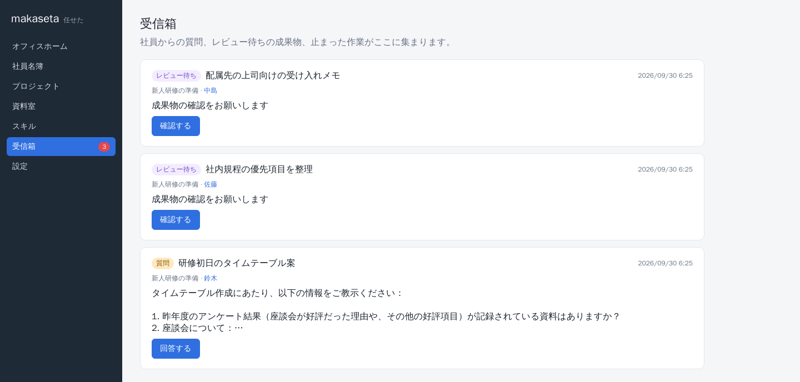

社員は、判断に必要な情報が足りないと質問してきます。質問は**受信箱**に「質問」として届き、カードはカンバンの「質問待ち」の列に移ります。

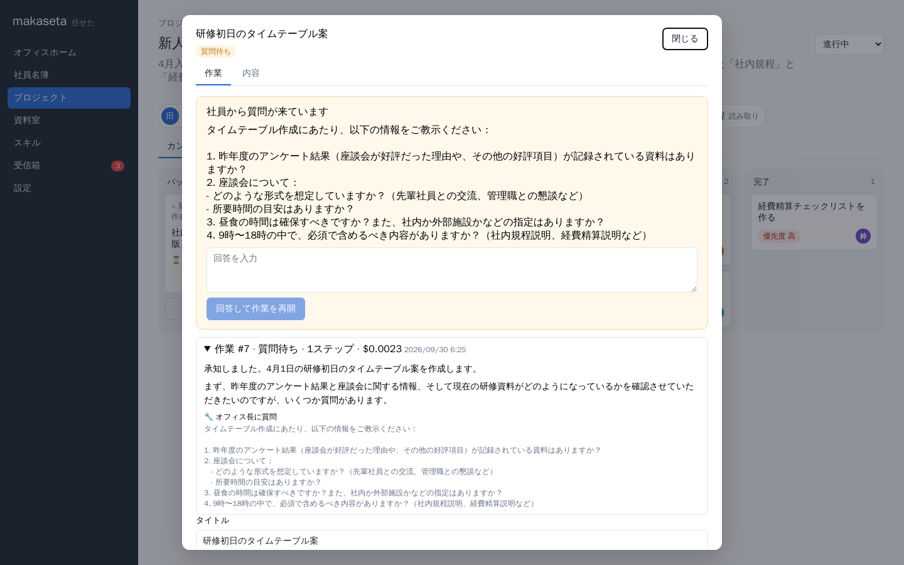

受信箱の「回答する」かカードを開くと、質問と回答欄が出ます。答えを書いて「回答して作業を再開」を押すと、社員が続きを始めます。

会話中の質問（依頼を受けたマネージャーの確認など）も受信箱に届き、スレッドの入力欄から答えられます。

## 8. 成果物をレビューする


作業が終わると、タスクは「レビュー待ち」になり、受信箱に届きます。カードを開くと、社員の報告、レビュー担当の所見、成果物の中身を確認できます。

- **承認して完了にする**を押すと、成果物が資料室に保存され、タスクは完了します。同名のファイルがあれば、旧版を残してから上書きします。
- 直してほしい点を書いて**差し戻す**と、コメントを踏まえて社員がやり直します。

「作業」タブでは、社員が何を調べ、何を考えたか（作業ログ）と、その作業の料金も確認できます。

## 9. 社員と話す


社員のアイコンや「💬 話す」を押すと、その社員とのスレッドが開きます。進捗を聞いたり、作業中の社員に追加の指示を出したりできます。社員は、参加しているプロジェクトの資料室を読んでから答えます。

### ファイルを指定して依頼する・話す

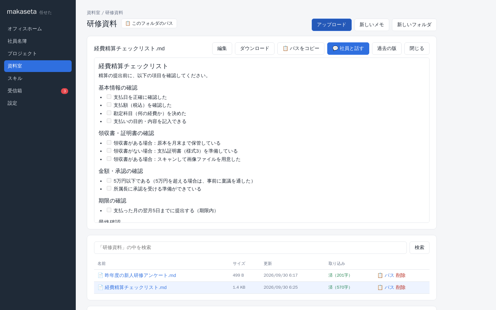

- ファイル一覧の「📋 パス」や、ファイルを開いたときの「📋 パスをコピー」で、`社内規程/人事/経費精算.md` の形（最初の `/` までが資料室名）のパスをコピーできます。タスクの指示や会話に貼れば、社員はそのファイルを読みます。
- フォルダの「📋 パス」や「📋 このフォルダのパス」では、`社内規程/人事/` のように末尾が `/` のパスをコピーできます。「`社内規程/人事/` の内容を参考にして」と書けば、社員はフォルダの中を一覧し、関係する文書を読んでから作業します。
- ファイルを開いて「💬 社員と話す」を押し、社員を選ぶと、そのファイルを指定した状態でスレッドが開きます。

## 10. 社員が育つ


タスクが承認・差し戻しされるたびに、社員は仕事を振り返り、学んだこと（オフィス長の好み、よく使う資料、指摘された点）を「業務メモ」に書き足します。次の仕事では、このメモを読んでから取りかかります。

業務メモと実績（完了数、一発で承認された割合、料金）は社員の詳細画面で確認できます。間違っているメモは直すか消し、伝えておきたいことは自分で書き足せます。

## 資料室の詳しい使い方

ホストの `./library` フォルダが資料室の置き場です。直下のフォルダ1つが1つの資料室になります。

```
library/
├── 社内規程/          ← 資料室「社内規程」
│   ├── 出張規程.md
│   └── 人事/経費精算.pdf
└── 研修資料/          ← 資料室「研修資料」
```

- ファイルを置けば、30秒以内に自動で取り込まれます（画面の「再読み込み」ですぐ反映もできます）。
- 画面からも、資料室やフォルダの作成、アップロード、Markdown メモの作成と編集、削除ができます。
- Markdown・テキスト・CSV・PDF・Word・Excel・PowerPoint からテキストを取り出し、日本語で全文検索できます。Shift_JIS のテキストも読めます。
- 上書きされたファイル（成果物の承認、画面での編集、同名のアップロード）は、旧版が資料室の `.makaseta/versions` に残り、ファイルを開いて「過去の版」から戻せます。
- 資料室を「機密」にすると、許可したプロバイダ（既定は Bedrock。`.env` の `CONFIDENTIAL_PROVIDERS`）のモデルを使う社員だけが読めます。
- 名前が `.` で始まるファイルとフォルダは無視されます。
- 別の場所を使う場合は、`.env` の `LIBRARY_DIR` を変更します（[インストールと設定](INSTALL.md#資料室のフォルダ)）。

## Web検索

組み込みスキル「Web検索」を社員に付けると、社員がインターネットで調べ、ページを読み、出典のURLを示して報告します（リサーチャーとアナリストの役職テンプレートには初めから付いています）。

- Anthropic API のモデルを使う社員だけが使えます（Bedrock では使えません）。
- 検索1回ごとに追加料金がかかります（1,000回で10ドル。`.env` の `WEB_SEARCH_PRICE_USD` で料金の計算に使う単価を変えられます）。1回の作業での検索は5回までです。

## スキル（Agent Skills）

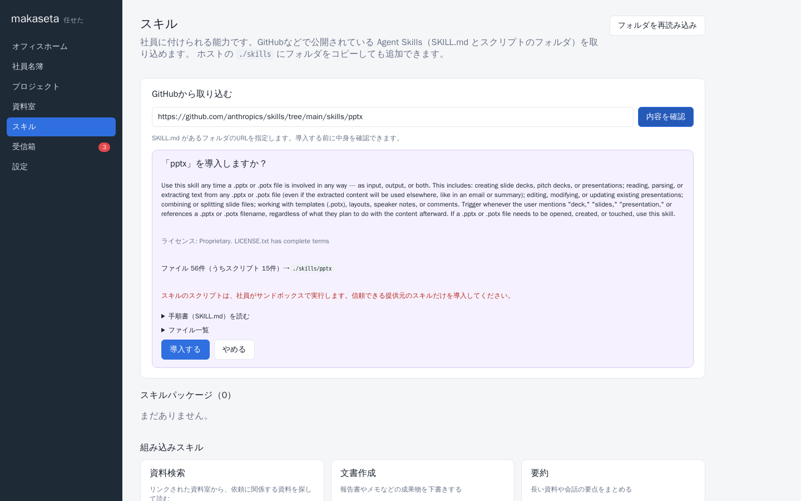

社員には、[Agent Skills](https://github.com/anthropics/skills) 形式のスキル（`SKILL.md` とスクリプトのフォルダ）を付けられます。

1. 画面の「スキル」で、GitHub のスキルのフォルダのURL（例: `https://github.com/anthropics/skills/tree/main/skills/pptx`）を入力し、「内容を確認」を押します。
2. 手順書・ライセンス・スクリプトを確認してから「導入する」を押します（`./skills/<名前>` に保存されます）。ホストの `./skills` にフォルダを直接コピーしても追加できます。
3. 社員名簿で、社員にスキルを付けます。

社員はスキルの手順書を読み、スクリプトを **サンドボックス**（`sandbox` コンテナ）で実行して、.pptx などのファイルを成果物として提出します。

サンドボックスの安全対策:

- アプリとは別のコンテナで、一般ユーザーとして動きます。DBの接続情報やAPIキーは渡しません。
- 触れられるのは、タスクごとの作業フォルダ（`./data/work`）と、読み取り専用のスキル（`./skills`）だけです。資料室のファイルは、社員がツールでコピーしたものだけが届きます。
- 既定ではインターネットに接続できません（`.env` の `SANDBOX_OFFLINE=false` で接続可）。アプリのAPIも呼べません。
- メモリ・CPU・プロセス数に上限があり（`SANDBOX_MEMORY` / `SANDBOX_CPUS`）、コマンドは時間切れで止まります。
- Python（python-pptx・openpyxl・python-docx・pypdf・pandas・markitdown など）、uv、Node.js（pptxgenjs など）、LibreOffice、日本語フォントが入っています。

公開されているスキルは任意のコードを含みます。信頼できる提供元のスキルだけを導入してください。

## よくある質問

**社員からの質問には、どこで答えればよいですか？**
受信箱です。カンバンの「質問待ち」のカードを開いても答えられます。[7. 質問に答える](#7-質問に答える) を見てください。

**カードを置いたのに、社員が作業を始めません。**
担当者が別の仕事をしている間は、バックログで待ちます（1人が同時に進める数は `MAX_ACTIVE_TASKS_PER_AGENT`）。前のタスクを待っているサブタスクは、前のタスクが承認されると始まります。今月の利用料金が `MONTHLY_BUDGET_USD` に達している場合も止まります（設定画面で確認できます）。

**料金はどこで見られますか？**
オフィスホーム（今月の合計）、設定画面（社員別・プロジェクト別）、タスクの「作業」タブ（作業ごと）、社員の詳細画面（社員ごと）で確認できます。

**マネージャーの計画を毎回承認するのが手間です。**
プロジェクトの「設定」タブで「タスク分解案は、オフィス長が承認してから実行する」をオフにします。
